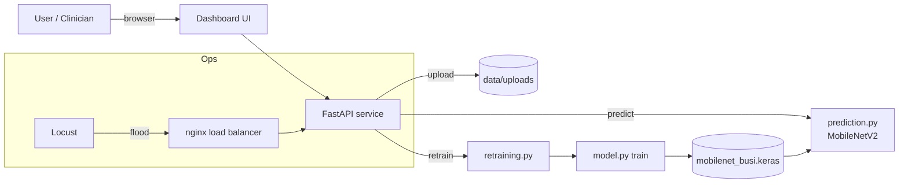

# CheckMe — Breast Ultrasound Classifier (MLOps Pipeline)

An end-to-end, deployable machine-learning pipeline that classifies **breast
ultrasound images** as **benign** or **malignant**, with a live dashboard for
prediction, monitoring, data visualization, bulk upload and one-click
retraining. It extends the Intro-to-ML summative (a classical-ML vs
deep-learning study on the same BUSI data) into a containerised, cloud-deployed,
load-tested service.

> **Model:** MobileNetV2 transfer learning · 224×224 · binary (benign/malignant)
> **Serving:** FastAPI + TensorFlow-CPU · **UI:** server-rendered dashboard + Chart.js
> **Ops:** Docker + nginx load balancer · Locust flood tests · Render deploy

---

## 🔗 Links

| Item | Link |
|------|------|
| 🎥 **Video demo (YouTube)** | _`<add your YouTube link here>`_ |
| 🌐 **Live app (Render URL)** | _`https://checkme-busi-classifier.onrender.com`_ (deploy to activate) |
| 📓 **Notebook** | [`notebook/busi_mlops.ipynb`](notebook/busi_mlops.ipynb) |
| 🧠 **Model file** | [`models/mobilenet_busi.keras`](models/mobilenet_busi.keras) |

---

## Project description

Breast cancer screening with ultrasound is operator-dependent. This project
delivers a decision-support classifier plus the full MLOps scaffolding around
it: reproducible data processing, training, evaluation, a REST API, a
monitoring UI, containerised deployment, load testing, and a retraining loop
that lets a clinician upload new labelled scans and refresh the model without a
redeploy.

The dataset is **BUSI** (Breast Ultrasound Images): 780 images across
benign / malignant / normal. Following the Intro-to-ML report, we treat the
**binary benign-vs-malignant** task and exclude `normal`. After de-duplication
and a stratified 80/20 split: **517 train / 129 test** images.

### The four required functionalities

1. **Model prediction** — upload one image, get benign/malignant + probabilities (`/api/predict`, *Predict* tab).
2. **Visualizations** — three interpreted features on the *Data & Visualizations* tab (class balance, echogenicity, image sizes).
3. **Upload data** — bulk-upload multiple labelled `.png` scans for retraining (`/api/upload`, *Upload & Retrain* tab).
4. **Trigger retraining** — a button retrains MobileNetV2 on the uploaded data and hot-swaps the live model (`/api/retrain`).

---

## Architecture



## Repository structure

```
MLOP-summative/
├── README.md
├── notebook/
│   └── busi_mlops.ipynb          # EDA, preprocessing, training, evaluation, prediction
├── src/
│   ├── preprocessing.py          # loading, cleaning, tf.data pipeline
│   ├── model.py                  # build / train / evaluate / retrain
│   ├── prediction.py             # single-image inference (cached model)
│   ├── retraining.py             # upload staging + background retrain job
│   ├── insights.py               # EDA payload + cache for the dashboard
│   └── api.py                    # FastAPI app (JSON API + dashboard)
├── ui/                           # templates/ + static/ (dashboard)
├── data/ (git-ignored, ~200MB)   # train/ and test/ — fetch via script
├── models/
│   ├── mobilenet_busi.keras      # the served model
│   ├── metrics.json              # held-out evaluation
│   └── viz_cache.json            # EDA snapshot for the cloud UI
├── locust/locustfile.py          # flood-test scenario
├── deploy/nginx.conf             # round-robin LB for scaling tests
├── scripts/                      # acquire_data.py, make_notebook.py, run_load_test.sh
├── Dockerfile · docker-compose.yml · render.yaml
└── tests/test_pipeline.py
```

---

## Model performance (held-out test set, n=129)

| Metric | Value |
|--------|-------|
| Accuracy | **72.9%** |
| Precision (malignant) | 56.6% |
| Recall / sensitivity (malignant) | **71.4%** |
| F1 (malignant) | 63.2% |
| ROC-AUC | **0.867** |

Confusion matrix and ROC curve are in [`reports/`](reports/) and render live on
the dashboard *Overview* tab. Recall on the malignant class is prioritised (via
class-weighting) — the clinically important axis for a screening aid.

---

## Setup

### 1. Local (development)

```bash
git clone <your-repo-url> && cd MLOP-summative
python3 -m venv venv && source venv/bin/activate
pip install -r requirements.txt

# Download + organise the BUSI dataset into data/train and data/test
python scripts/acquire_data.py

# (Optional) train the model — a pre-trained models/mobilenet_busi.keras is committed
python -m src.model --epochs-head 20 --epochs-finetune 12

# Run the API + dashboard
uvicorn src.api:app --host 0.0.0.0 --port 8000
# open http://localhost:8000
```

### 2. Docker

```bash
docker build -t checkme-busi .
docker run -p 8000:8000 checkme-busi
# open http://localhost:8000
```

### 3. Notebook

```bash
pip install jupyter
jupyter notebook notebook/busi_mlops.ipynb
```

### 4. Tests

```bash
pytest -q
```

---

## Flood-request simulation (Locust)

Locust hammers `/api/predict` (a real image forward-pass) with concurrent
users. We compare latency and throughput as the number of serving instances
(containers / workers) increases — each instance holds its own copy of the
model, so this is genuine horizontal scaling.

**Test:** 20 concurrent users, spawn 10/s, 30 s, POSTing a real ultrasound PNG.

| Serving instances | Predictions | Failures | Median | p95 | Max | Throughput |
|-------------------|-------------|----------|--------|-----|-----|------------|
| **1** | 505 | 0 | 470 ms | 1100 ms | 2147 ms | 17.4 pred/s |
| **4** | 877 | 0 | **150 ms** | **550 ms** | 12538 ms* | **30.2 pred/s** |

\* the single 12.5 s max is a cold-start outlier on the 4th worker's first
request (model load); steady-state p95 improved 2×.

**Reading the results:** scaling from 1 → 4 instances cut **median latency 3.1×**
(470 → 150 ms), roughly **doubled throughput** (17 → 30 predictions/s), and kept
**zero failures**. The story: this CPU model is compute-bound per request, so
adding instances behind a load balancer is the right lever — exactly what the
container/replica knob provides.

### Reproduce with real Docker containers

```bash
# nginx round-robins across N api replicas on :8080
./scripts/run_load_test.sh "1 2 3"     # tests 1, 2 and 3 containers
# results saved to results/containers_<N>_stats.csv
```

Or manually:

```bash
docker compose up -d --build --scale api=3
locust -f locust/locustfile.py --host http://localhost:8080   # UI at :8089
```

---

## Retraining loop

1. On the **Upload & Retrain** tab, pick a label (benign/malignant) and upload
   multiple `.png` scans → they stage under `data/uploads/<class>/`.
2. Once ≥ 20 pending images accumulate, the UI **recommends** a retrain
   (the automatic trigger); you can also retrain manually at any time.
3. **Retrain now** merges staged images into `data/train/`, runs the two-phase
   MobileNetV2 training on a background thread, evaluates on the test set, and
   **hot-swaps** the live model — no restart, no redeploy.
4. `/api/retrain/status` streams progress to the dashboard.

---

## Deploy to Render

1. Push this repo to GitHub.
2. Render → **New → Blueprint** → select the repo (uses [`render.yaml`](render.yaml)).
3. Render builds the Docker image and serves it; health-checks hit `/health`.
4. Use the **Standard** plan (2 GB) — TensorFlow needs ~600 MB+ resident, so the
   Free/Starter 512 MB tiers will OOM at model load.

The committed model (`models/mobilenet_busi.keras`) and `viz_cache.json` make
the deployed app fully functional for prediction, monitoring and visualization
without shipping the 200 MB dataset.

---

## API reference

| Method | Endpoint | Purpose |
|--------|----------|---------|
| GET | `/` | Dashboard UI |
| GET | `/health` | Liveness probe |
| GET | `/api/status` | Uptime, model version, pending uploads, retrain state |
| GET | `/api/metrics` | Held-out evaluation metrics |
| GET | `/api/visualizations` | EDA data for charts |
| POST | `/api/predict` | Classify one uploaded image |
| POST | `/api/upload` | Stage bulk images for retraining |
| POST | `/api/retrain` | Trigger a retrain (background) |
| GET | `/api/retrain/status` | Poll the retrain job |

---

## Tech stack

TensorFlow/Keras (MobileNetV2) · FastAPI · Uvicorn · Chart.js · Locust ·
Docker · nginx · Render · scikit-learn · Pillow · pandas/matplotlib/seaborn.

_CheckMe Ltd — MLOps summative._
